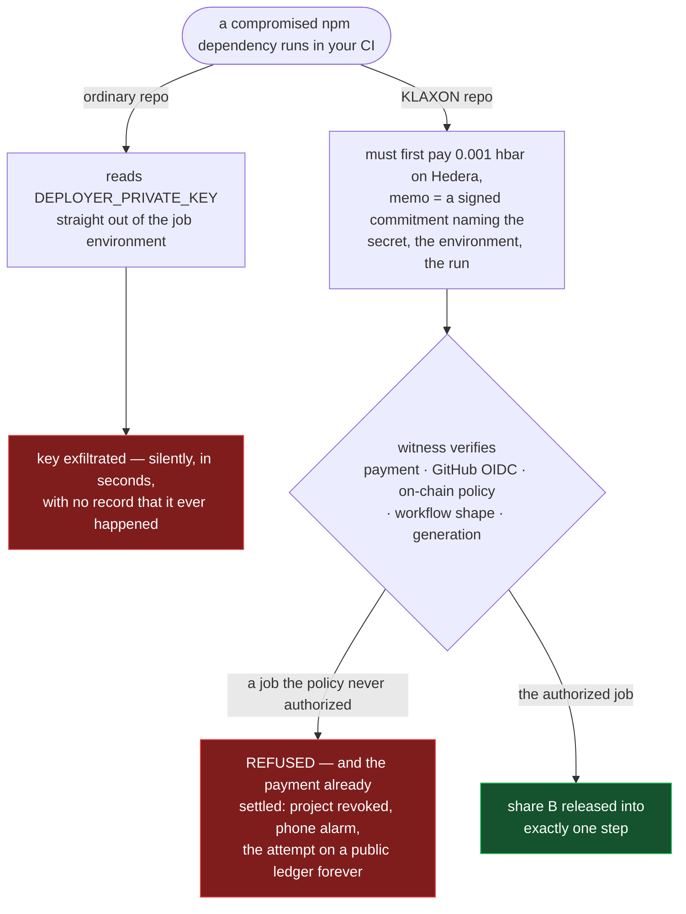

# KLAXON

> **Stolen, but never quietly.**

**Take everything and you still cannot use it.** Take the encrypted share straight out of the
repository. Take the Key Ring credential off the runner. Take the payment key. Take a copy of the
release step itself. None of it releases the secret anywhere except the one job the owner
authorized — and finding that out costs a payment that is public before the refusal is.

That is not a thought experiment. In this repository's own demo, a compromised npm dependency read
**147 environment variables out of the protected pipeline and found nothing worth having**, and an
attacker holding every credential above ran the real release step from a job they controlled, paid
for it, and was refused. Both runs are linked below, with their Hedera receipts.

Your CI secrets are split in two. Share A is encrypted under your **Ledger Key Ring** and lives in
your repo. Share B is released by a witness only when **the runner itself has paid on Hedera** — a
sub-cent x402 payment whose memo is the hash of a signed release commitment naming the secret, the
environment, the run, and an ephemeral key only that runner holds. Neither share is useful alone.

**And no secret can be decrypted for the first time without a commitment the runner wrote to a
public ledger first.** The witness can't omit it — the runner authored it. The witness can't forge
it — it needs GitHub's signature and the runner's. Nobody can back-date it — Hedera consensus
timestamps it.

One exception, stated here rather than buried: a job that was *already* authorized can read what it
was authorized to receive. That is true of every system that hands a process a working credential,
and the precise boundary is [below](#the-claim-stated-precisely).



*Left path is how it works today. Right path is what this repo does — and both have really run:
see the runs and their on-chain receipts below.*

## Status — read this first

A hackathon build (ETHOnline 2026). As of **2026-09-13** both halves have been exercised on real
hardware and real networks. Nothing below is mocked, stubbed or re-enacted.

**Hardware.** A physical Ledger Nano S Plus enrolled the Key Ring with `wallet-cli ring init`, and
device-signed `register`, `commitPolicy` and `unrevoke` against the registry. Gate A
(`scripts/gate-a.sh`) passes: share A is decrypted inside a clean `node:24` container holding only
the member credential — no device, no keychain — and the real `wallet-cli ring decrypt` opens the
very same ciphertext.

**On chain.** Registry [`0xd93f10104d4069B26c8ee883c3eAb3AAaaD56885`](https://sepolia.etherscan.io/address/0xd93f10104d4069B26c8ee883c3eAb3AAaaD56885)
on Sepolia holds the project's owner and the policy hash its Ledger anchored. Hedera topic
`0.0.10503843` carries every release and every refusal.

**End to end, in CI.** [`klaxon-demo`](https://github.com/KaranSinghBisht/klaxon-demo) runs three
workflows on hosted GitHub runners:

| Workflow | Outcome | Evidence |
|---|---|---|
| `ordinary` | key stolen | a postinstall worm reads a plain CI secret out of the job environment |
| `deploy` | released | commitment `4fc22410…`, paid by tx `0.0.7162784@1789236322.630057787`; the mirror node shows the transaction memo **equals** that commitment |
| `worm-attack` | **paid, then refused** | commitment `eba93fa7…`; the witness was credited 0.001 ℏ, refused at check 4 (no environment), and revoked the project |

The refusal is the one to read twice. The attacker held the member credential, the pay key, the
encrypted share and a copy of the release step, ran it, and paid — and the payment is what put the
attempt on a public ledger.

**Not done:** no ERC-7730 clear-signing descriptor has been filed, so policy commits are blind-signed;
and the witness is a single instance on one host ([`docs/OPERATIONS.md`](docs/OPERATIONS.md)).

What KLAXON does *not* claim is unchanged, and is stated in full below.

## Why

In H1 2026, infrastructure and operational compromises accounted for **~76% of all crypto funds
stolen** from only **~15% of incidents** — the losses are not smart-contract bugs, they are stolen
credentials. Shai-Hulud 2.0 hit **~700 npm packages** in November 2025 and spawned **25,000+
malicious repositories**; the same campaign's leaked API key was used to publish a trojanized Trust
Wallet extension that drained **$8.5M**. Every statistic here is sourced in
[`docs/SOURCES.md`](docs/SOURCES.md).

The industry answer is short-lived, identity-bound credentials — OIDC to AWS, npm trusted publishing,
Vault's JWT auth. That works, and where it exists you should use it. It does not exist for the sixty
other tokens in a real pipeline: an Etherscan key, a Vercel token, a deployer private key. Those are
long-lived strings in a CI environment, and when one is read there is no record that it happened.

KLAXON does not try to stop a compromised job from reading a secret it was authorized to receive. It
makes the *first* read impossible to perform silently, and it names exactly what was read.

## The claim, stated precisely

What KLAXON **guarantees**: no secret is released for the first time without a release commitment
that (1) the runner itself paid to place on Hedera, (2) names the secret, environment, run and an
ephemeral key only that runner holds, and (3) reached consensus before share B moved.

What KLAXON **does not** do: prevent a compromised authorized job from reading what it was authorized
to receive; stop an attacker replaying a share B it already captured; survive simultaneous compromise
of a runner *and* the witness.

**The word *first* is load-bearing.** Share B is derived, not random —
`B = HKDF(WITNESS_MASTER, "klaxon/b/v1", project_id/secret/gen)` — so every release of a generation
returns the same 32 bytes, and share A in git does not change within a generation. Anything that
captures both once can decrypt that generation offline from then on: no payment, no token, no record.
One observed release under a compromised runner is full compromise of that generation, and rotating
to `gen + 1` with a genuinely new upstream credential is the only remediation.

Full statement: [`docs/CLAIM.md`](docs/CLAIM.md). Engineering version, including what the workflow
lint does and does not catch and why revocation is announced rather than anchored:
[`docs/THREAT-MODEL.md`](docs/THREAT-MODEL.md).

## Payment flow

The witness's `POST /release/:h` is a live x402-gated service on Hedera, settled through the
**Blocky402** facilitator. The GitHub Action is the platform that consumes it. **The payment is not a
fee for a proof — it is the release commitment itself.**

1. The runner builds the commitment `C`, hashes it to `h`, and mints an OIDC token with
   `aud = klaxon:<h>`.
2. `POST /release/:h` answers **402** with x402 `PaymentRequirements`: `network: hedera:testnet`,
   `payTo: <witness>`, `price: {amount: "100000", asset: "0.0.0"}` (0.001 ℏ), and **`extra.memo = h`**.
3. Stock x402 has no memo concept, so the action uses a custom `ClientHederaSigner`: it builds the
   `TransferTransaction`, calls **`setTransactionMemo(h)`**, sets the facilitator as fee payer,
   freezes, and signs with `KLAXON_PAY_KEY`.
4. The witness calls Blocky402 `/verify` then `/settle`. The facilitator adds its fee-payer signature
   and submits — it cannot alter the memo, which is inside the body the runner signed.
5. The witness reads the settled transaction back from the **mirror node** and requires
   `result == SUCCESS`, the memo to decode to `h`, itself credited ≥ price, the debit to be the
   project's registered pay account, and the timestamp to be fresh. Then eight more checks.
6. On success a `released` message carrying `pay_tx` is published to the project's HCS topic
   **before** share B is returned.

Roughly 7–10 s per release. `klaxon-verify` reads every payment to the witness account from the
public mirror node and flags any with no matching message as **`WITNESS WITHHELD`** — the witness
cannot omit a Hedera transfer it did not author. Detail, including exactly what each side binds on
and why neither binds on `payer_account_id`: [`docs/PAYMENT-FLOW.md`](docs/PAYMENT-FLOW.md).

### What a release costs the witness

Measured on testnet, not estimated — read it back off the mirror node for account `0.0.10455530`:

| | tinybar |
|---|---|
| Revenue, one release | 100,000 |
| 3 × `CONSENSUSSUBMITMESSAGE` (chunked audit record) | 3,072,929 |
| 1 × transaction record query | 133,908 |
| **Net** | **−3,106,837, about a 32× loss** |

This is deliberate and it is worth being precise about why. The audit record carries the runner's
**entire OIDC token**, so a verifier can check the claims against GitHub's keys without asking
anyone's permission. That does not fit in one 1 KB HCS message, so it chunks into three. Publishing
a hash instead would cost a third as much and make the record unfalsifiable-but-uncheckable, which
defeats the point.

So the 0.001 ℏ is **not a fee that recovers cost, and was never priced to.** It is the commitment
device: the smallest real, attributable, publicly-ordered act that a runner can be made to perform
before a secret moves. Priced for cost recovery it would be about 0.035 ℏ, still well under a US
cent, and that is what a production deployment should charge.

The honest consequence: a refused attempt costs the witness roughly 32× what the attacker paid, and
there is **no HTTP rate limiter in the witness today**. A party who can mint a valid GitHub OIDC
token for a registered repository can therefore drain a witness's balance at 32:1. Check 7's release
budget bounds successful releases per project, not refusals. Rate limiting and a refusal budget are
the fix, and neither is implemented — see [`docs/OPERATIONS.md`](docs/OPERATIONS.md).

## Quickstart

Requires Node ≥ 22 and pnpm 11.

```bash
git clone https://github.com/KaranSinghBisht/klaxon && cd klaxon
pnpm install          # needs the stub override in pnpm-workspace.yaml — see docs/LEDGER-FEEDBACK.md §5
pnpm test             # unit tests; the wallet-cli interop test is skipped without a device
pnpm build && pnpm typecheck && pnpm lint
```

Setting up a protected repository — this is the intended sequence, and steps 1 and 3 need the Ledger:

```bash
klaxon init --repository ORG/REPO --repository-id 123456789 \
            --witness https://your-witness --registry 0xREG   # ring init, HCS topic, register on Sepolia
klaxon export-member                                          # → secrets.KLAXON_MEMBER (printed once)
printf '%s' "$VALUE" | klaxon add DEPLOYER_PRIVATE_KEY        # → .klaxon/DEPLOYER_PRIVATE_KEY.enc, committed
klaxon policy commit                                          # device-signs the policy hash onto Sepolia
```

Then in the workflow — note the split between an install job and the environment-bearing job that
holds no install step, which the witness enforces:

```yaml
deploy:
  needs: build
  environment: production
  permissions: { id-token: write, contents: read }
  steps:
    - uses: actions/checkout@<40-hex>          # the action reads .klaxon/<NAME>.enc from the checkout
    - uses: actions/download-artifact@<40-hex>
    - id: klaxon
      uses: KaranSinghBisht/klaxon/packages/action@<40-hex>
      with:
        secret: DEPLOYER_PRIVATE_KEY
        member: ${{ secrets.KLAXON_MEMBER }}
        pay-account: ${{ vars.KLAXON_PAY_ACCOUNT }}
        pay-key: ${{ secrets.KLAXON_PAY_KEY }}
    - run: forge script script/Deploy.s.sol --broadcast
      env: { DEPLOYER_PRIVATE_KEY: "${{ steps.klaxon.outputs.value }}" }
```

Per-repo checklist, including what the split job pattern does and does not buy you:
[`docs/MIGRATION.md`](docs/MIGRATION.md). Runbook: [`docs/OPERATIONS.md`](docs/OPERATIONS.md).

## Verify it yourself

Nothing here asks you to trust the witness, and the fastest checks need no clone at all.

**Look at the audit trail in a browser.** [`44-198-37-65.sslip.io/audit`](https://44-198-37-65.sslip.io/audit)
renders every release and every refusal, and for each one fetches the payment and re-checks, in your
browser, that the transaction memo really is the commitment hash in the record. It reads the Hedera
mirror node directly and calls no KLAXON service — if this witness went down, or started lying, that
page would keep working and would say so.

**The service is live.** It answers an x402 challenge for any commitment you name:

```bash
curl -s https://44-198-37-65.sslip.io/.well-known/klaxon.json | jq
curl -si https://44-198-37-65.sslip.io/release/$(openssl rand -hex 32) | head -3   # 402 + PAYMENT-REQUIRED
```

**A real release, and a real refusal, on public Hedera data.** The first is the payment that released
`DEPLOYER_PRIVATE_KEY` into a production deploy; the second is a worm that paid and was refused. In
both, the transaction memo **is** the commitment hash:

```bash
# released — memo decodes to 4fc22410…, the same h as the `released` message on the topic
curl -s https://testnet.mirrornode.hedera.com/api/v1/transactions/0.0.7162784-1789236322-630057787 \
  | jq -r '.transactions[0].memo_base64' | base64 -d; echo

# the audit topic: released, refused (class policy, check 4), unrevoke
curl -s 'https://testnet.mirrornode.hedera.com/api/v1/topics/0.0.10503843/messages?limit=10&order=asc' \
  | jq -r '.messages[] | .sequence_number, (.message|@base64d)' | head -40
```

**The independent verifier.** `klaxon-verify` re-derives the entire release history from the mirror
node, the HCS topic and Sepolia. **It never talks to the witness**, and shares no code with it:
`@klaxon/verify` has a zero-line dependency on `@klaxon/core` and reimplements JCS canonicalization,
hashing and the JWT path separately, so "it does not trust me" is literally true.

```bash
git clone https://github.com/KaranSinghBisht/klaxon && cd klaxon && pnpm install
cd packages/verify && npx tsx src/bin.ts \
  --topic 0.0.10503843 \
  --witness 0.0.10455530 \
  --registry 0xd93f10104d4069B26c8ee883c3eAb3AAaaD56885
```

Add `--json` for a machine-readable report. Exit codes: `0` clean, `1` violations found, `2` the read
could not complete. `--since` takes a Hedera consensus timestamp (`seconds.nanos`), not a date.

It reports `WITNESS WITHHELD` (a payment with no message), `DOUBLE_RELEASE`, `ORDERING`,
`MESSAGE_INCOMPLETE` and `RELEASE_WHILE_REVOKED`, checks every JWT against the keys that were live at
the *payment's* consensus time, and checks the policy against the hash anchored on Sepolia.

> **It currently reports one violation, and that is the tool working.** A Gate B test payment on
> 2026-09-10 went to this witness account from a local instance that never published a message for
> it. A payment to the witness with no matching record on the topic is exactly what `WITNESS WITHHELD`
> is for, and the verifier finds it without being told. The alternative — a verifier that only ever
> prints "clean" — would prove nothing.

Protocol details, including the wire format of every message on the topic:
[`docs/PROTOCOL.md`](docs/PROTOCOL.md).

## Prior work & disclosure

KLAXON's invariant — *a public, unforgeable record as a precondition of decryption* — is not new. What
is new, as far as we can find, is applying it to CI secret release with the record authored by the
consumer and the gate rooted in a hardware wallet. Everything below was checked against its source on
2026-09-09; where our earlier notes were wrong, the correction is stated.

**The same invariant, formalised**
- **Fialka** — *An Accountable Decryption System Based on Privacy-Preserving Smart Contracts*, Li,
  Wang, Liu, Wang & Galindo, **ISC 2020** (LNCS 12472, pp. 372–390),
  [doi](https://doi.org/10.1007/978-3-030-62974-8_21) ·
  [open PDF](https://zenodo.org/records/4556922). A privacy-preserving smart contract is both key
  manager and transparent judge, so a lawful-interception decryption cannot happen without leaving a
  public record. *Difference:* Fialka makes a **third party's** decryption of *someone else's* data
  accountable to a court; KLAXON makes the secret's own legitimate consumer author the record about
  itself. Follow-up, TEE-assisted and formalised: [ePrint 2023/1519](https://eprint.iacr.org/2023/1519)
  (preprint only — no peer-reviewed venue found).
- **Google Cloud Key Access Justifications**
  ([docs](https://docs.cloud.google.com/assured-workloads/key-access-justifications/docs/overview)) —
  the closest deployed system: every key use emits a machine-readable justification that the
  customer's external key manager records and can **deny** on. *Difference:* the record is private,
  enterprise-scoped, and written by the party requesting access to *someone else's* key; KLAXON's is
  public, permissionless, consensus-timestamped, and written by the party about to use its own secret.

**Ledger building the same half — this is our substrate, not a competitor**
- **`wallet-cli ring`** (LKRP secret encrypt/decrypt): shipped in wallet-cli 2.0.0 via
  [PR #19477](https://github.com/LedgerHQ/ledger-live/pull/19477) (merged 2026-07-10). The explicitly
  agentic/CI framing — a section headed *"Password injection without a TTY (agentic / CI)"* — is in
  the earlier, **closed** [#16859](https://github.com/LedgerHQ/ledger-live/pull/16859);
  [#17743](https://github.com/LedgerHQ/ledger-live/pull/17743) is also closed. *Difference:* `ring`
  gives hardware-rooted, recoverable encryption of a repo-committed file, gated on trustchain
  membership alone and leaving **no public trace**. KLAXON adds the commitment that makes the first
  decryption observable. Our feedback to Ledger, including a bug in shipped code, is in
  [`docs/LEDGER-FEEDBACK.md`](docs/LEDGER-FEEDBACK.md).

**Encrypted secrets in the repo, gated on identity**
- **DMNO PKP secrets** — [ETHGlobal SF 2024](https://ethglobal.com/showcase/dmno-pkp-secrets-vaytr),
  [repo](https://github.com/dmno-dev/ethsf-2024). An encrypted secrets file committed to the repo, a
  Lit PKP for encryption, decryption gated on GitHub org team membership with the ACL as a Sign
  Protocol attestation. *Difference:* gates on **who you are**, checked privately, with no public
  artifact per decryption. Honest caveat: this was a hackathon prototype and **never shipped** — the
  DMNO plugin actually [documented today](https://dmno.dev/docs/plugins/encrypted-vault/) is a
  symmetric-key vault with a hand-shared key.
- **Lit Actions access control conditions**
  ([docs](https://developer.litprotocol.com/sdk/access-control/intro),
  [blog](https://spark.litprotocol.com/using-lit-actions-for-access-control/)) — a ciphertext's access
  condition names a Lit Action by IPFS CID, so it decrypts only inside that exact code. *Difference:*
  gates on **code identity**, decided by a private threshold-node vote that leaves no public record.
  Lit answers "is the right code asking?"; KLAXON answers "did the world get told?". *Correction to an
  earlier note of ours:* there is no official Lit product called "Lit Secrets" — that name belongs to
  an [ETHGlobal Bangkok 2024 project](https://ethglobal.com/showcase/lit-secrets-a3pxh) later adopted
  into Lit's GitHub org.

**OIDC to ephemeral key to public log**
- **Sigstore Fulcio + Rekor** ([Fulcio](https://docs.sigstore.dev/certificate_authority/overview/),
  [Rekor](https://docs.sigstore.dev/logging/overview/)) — OIDC identity → ~10-minute ephemeral
  certificate → append-only public transparency log; the key is discarded and trust comes from the
  log. Structurally the closest thing to KLAXON's commitment. *Difference:* Rekor logs **signing**,
  not **access**, and it is written *after* an act that already succeeded. It is a record, not a
  precondition. KLAXON inverts the arrow: no record, no plaintext.

**Preventing the exfiltration KLAXON records**
- **StepSecurity Harden-Runner** ([repo](https://github.com/step-security/harden-runner)) — egress
  filtering and blocking for GitHub Actions runners, free for public repositories on GitHub-hosted
  runners, with `egress-policy: block` and a domain allowlist. *Difference:* it tries to stop the
  secret **leaving**; KLAXON assumes the perimeter fails and makes the secret's first use impossible
  to perform quietly. The two compose, and you should probably run both. Precision note: the free
  community agent enforces at DNS/L3-L4 (DNS proxy + iptables); the eBPF path is Enterprise/ARC. Its
  community-tier blocking has been bypassed repeatedly — CVE-2026-32947 (DNS-over-HTTPS),
  CVE-2026-32946 (DNS-over-TCP), CVE-2026-25598, CVE-2025-32955.

**The industry default we are competing with**
- **HashiCorp Vault + GitHub OIDC/JWT auth**
  ([docs](https://docs.github.com/en/actions/how-tos/secure-your-work/security-harden-deployments/oidc-in-hashicorp-vault)),
  and **GitHub OIDC → AWS/GCP workload identity federation**. Short-lived, identity-bound CI
  credentials — genuinely the right answer wherever the destination speaks OIDC. *Difference:* the
  audit log is private, operator-controlled and mutable by the operator, and neither covers a secret
  whose destination has no OIDC path. KLAXON is for those.
- Also adjacent, in one line each: **Mozilla SOPS / age / git-crypt** — the same shape as share A
  (encrypted secret in the repo) with no gate and no record; **AWS KMS + CloudTrail** — every
  `Decrypt` is logged, but after the fact, privately, and mutably by the account owner;
  **[Threshold TACo](https://docs.taco.build/)** — on-chain conditions are *checked*, not *published*;
  **[drand / tlock](https://github.com/drand/tlock)** — the precondition is the passage of time, not
  an act by the decryptor.

**Disclosure.** Nothing in this repository was reused from any prior project. It was built with
Claude Code as the primary engineering assistant under human direction, with one cold review from
OpenAI Codex; the full account, including what has *not* happened yet, is in
[`docs/AI-USAGE.md`](docs/AI-USAGE.md). Commit history is unsquashed and every commit names the model
that wrote it. Nine adversarial reviews were run during design by AI personas, not by anyone from a
sponsor or from ETHGlobal; they are **simulations, not real judge feedback**, and are kept out of
this repository as working notes.

## Repository

| Path | What |
|---|---|
| `packages/core` | canonicalization, hashing, AEAD, XOR split, ECIES, ephemeral keys, LKRP domain key, operator signing |
| `packages/cli` | `klaxon` — `init`, `export-member`, `policy commit`, `add`, `get`, `rotate`, `revoke`, `unrevoke`, `emergency` |
| `packages/witness` | Fastify + `node:sqlite`; nine release checks, HCS outbox, Sepolia watcher, ntfy alarm |
| `packages/verify` | `klaxon-verify` — independent verifier, zero dependency on core |
| `packages/action` | the Node 24 GitHub Action that pays and consumes the release |
| `packages/contracts` | `KlaxonRegistry` (Foundry) + the ERC-7730 descriptor |
| `docs/` | claim · threat model · protocol · payment flow · operations · migration · Ledger feedback · AI usage · sources |

Built for ETHOnline 2026. Apache-2.0.
